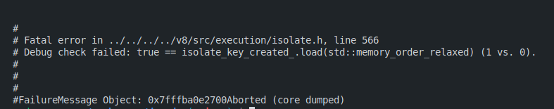

# Denode

Idea: Embed Deno in Nodejs. Simple? No.

https://github.com/littledivy/denode

Uses `deno_runtime` crate (provides Deno's OPs without extra tooling) & `deno_core` to spin up a Deno VM. So far, its doable.

Next we, use `neon` crate for generating bindings to Node.js through Rust. Yupp, and then _require_ the dynamic lib in Node.

Issue: It doesn't work :| 

I'm not sure what the error means but i'm assuming its related to 2 v8 instances spinning up.
