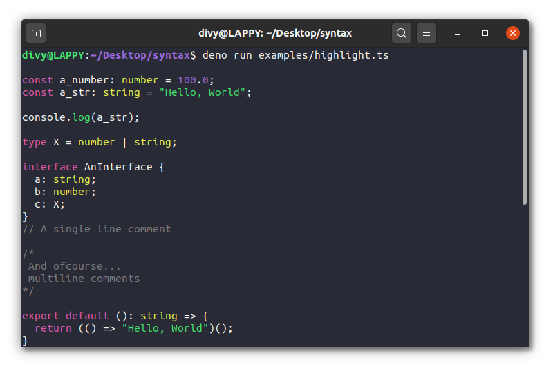

# Syntax highlighting - Hue

Idea: Lightweight, syntax highlighting for the terminal and the web.

Project: https://github.com/littledivy/hue



It implements a minimal lexer & tokens for C-like languages which can be easily extended for all kinds of weird syntax. 

### Languages

> This list is expanding and may not be up-to-date. Refer to the main repo.

#### Typescript

- Keywords (certain keywords were moved to a different category for better themeing)

  ```
  abstract
  as
  asserts
  async
  await
  break
  case
  catch
  class
  const
  continue
  debugger
  declare
  default
  delete
  do
  else
  enum
  export
  extends
  finally
  for
  from
  function
  get
  if
  implements
  import
  in
  instanceof
  interface
  is
  keyof
  let
  namespace
  new
  null
  of
  package
  private
  protected
  public
  readonly
  return
  require
  set
  static
  super
  switch
  throw
  try
  type
  typeof
  undefined
  var
  void
  while
  with
  yield
  ```

  Default theme color: `red`

- Globals
  
  ```
  Deno
  process
  window
  globalThis
  this
  ```
  
  Default theme color: none, `italics`.

- Types
  
  ```
  string
  any
  number
  this // italics + colored
  // TODO: all primitive types
  ```

  Default theme color: `yellow`

- Exceptions
  
  Commonly used syntax that deserves a change in color.
  ```
  constructor // reserved method
  
  // boolean values 
  true
  false
  ```

  Default theme color: `green`

- String
  
  String literals are colored in green. Refer to the screenshot above.

  Default theme color: `green`

- Number
  
  Number literals are colored in blue. Refer to the screenshot above.
  
  Default theme color: `blue`

- Operators
  
  ```
  +
  -
  ^
  &
  %
  |
  /
  !
  ```

  Default theme color: `cyan`

TODO: More notes on the topic. Support for browsers. Comments highlighting. Language support.

Cya!
